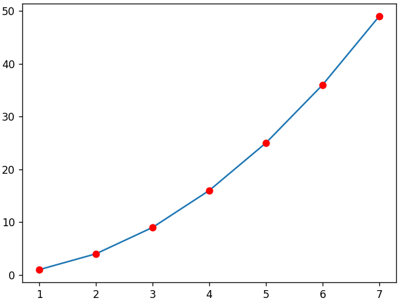

# Fundamentals of deep learning
## Curve fit

For a given dataset, the goal is to optimize the known function's parameters in order to express the relationship between the 1 dimensional input and output.


### Optimization
First, we observe the trend by plotting the scattered input vs output to estimate:

- An appropriate funtion that follows the same trend

- Guess parameters of that function

- Optimization of the above parameters is done using "curve-fit" from "scipy.optimize" library.


### Usage/Examples

```javascript
# Appropriate funtion
def expo(t, c0, c1, c2, c3):
    return t*t+c0+c1+c2+c3

# Guess parameters
g = [5, 5, 0, 0]

# Optimization
inp = data['Input'].values
out = data['Output'].values
c, cov = curve_fit(expo, inp, out, g, maxfev=100000)
print(c)
}
```


### Screenshots




## Simple neural network

In deep learning, instead of us manually assuming a function based on the trend, we let the neural netowrk to approximate a function that closely defines the mapping of input onto output.
### Weights and biases

Each inputs can be imagined as a node in a neural network. The weights are the strength of the input signal and biases decides the activation of the neurons.
### Forward and backward pass

- Weighted sum of input is passed through an activation function

- Loss is calculated between the activated weighted sum and output

- Using the chain rule derivative of loss w.r.t the weights are calculated

- Weights are updated using gradient descent update rule

### Screenshots


## FAQ

#### Q1 Where can I find a detailed explaination on deep learning?

https://en.wikipedia.org/wiki/Neural_network

#### Q2 What is chain rule?

https://en.wikipedia.org/wiki/Chain_rule


## Conclusion

For a 1D input and output, neural network is created without any machine learning framework.

